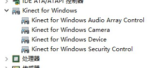
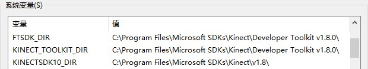
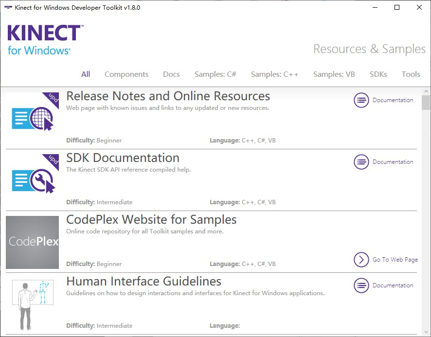
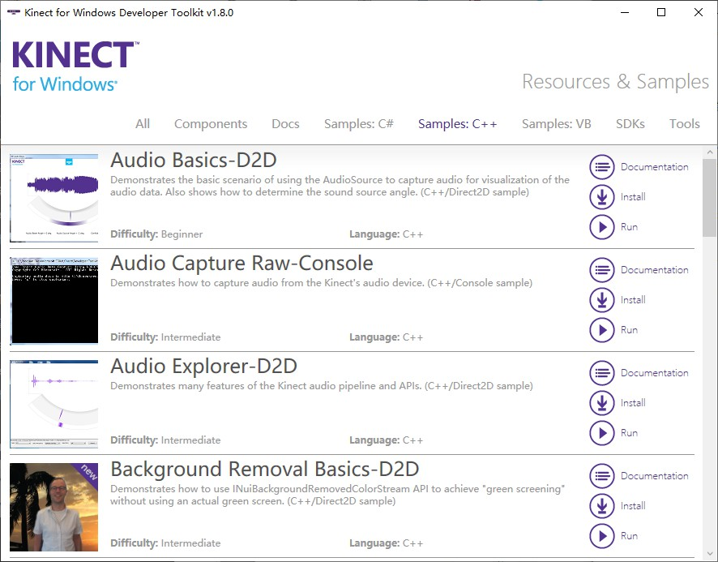

Kinect 环境配置
===================

.. _install:

Kinect v1.8 SDK
-------------------

- 微软官方 SDK 下载页面：\ `Kinect for Windows SDK v1.8 <https://www.microsoft.com/en-us/download/details.aspx?id=40278>`_ (222MB)
- 微软官方 ToolKit 下载页面：\ `Kinect for Windows Developer Toolkit v1.8 <https://www.microsoft.com/en-us/download/details.aspx?id=40276>`_ (384MB)

在上面两个页面下载并安装 Kinect SDK 和 ToolKit 的安装包，完成后连接 Kinect 设备，检查设备管理器，能够看到 Kinect 设备即为安装成功。

.. note::

    安装过程中 Kinect 设备\ **不要连接电脑**\ 。

另外，查看系统环境变量，会发现 Kinect SDK 所在路径也被添加到了系统变量，在配置 Visual Studio 项目时可以直接引用。

开发包附带了一些软件，其中 Developer Toolkit Browser v1.8 中提供了一些资料和例程，可以运行玩一玩。

.. _install-2:

Kinect v2.0 SDK
-------------------

微软官方 SDK 下载页面：\ `Kinect for Windows SDK 2.0 <https://www.microsoft.com/en-us/download/details.aspx?id=44561>`_ (276MB)

在上面的页面下载并安装 Kinect SDK 的安装包，完成后连接 Kinect 设备，检查设备管理器，能够看到 Kinect 设备即为安装成功。

.. note::

    安装过程中 Kinect 设备\ **不要连接电脑**\ 。

查看系统环境变量，会发现 Kinect SDK 所在路径也被添加到了系统变量，在配置 Visual Studio 项目时可以直接引用。

开发包附带了一些软件，其中 SDK Browser v2.0 中提供了一个自检程序 Kinect Configuration Verifier，可以检查 Kinect 是否连接成功。除此之外还提供了一些资料和例程，可以运行玩一玩。
