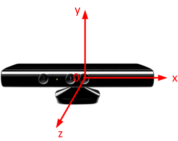
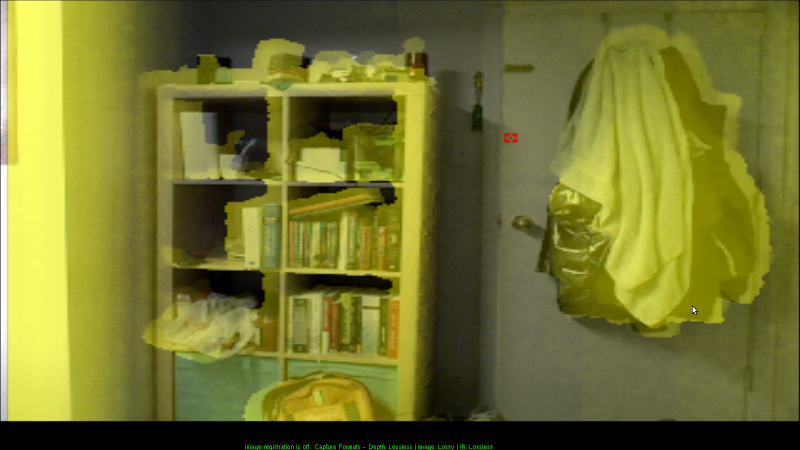
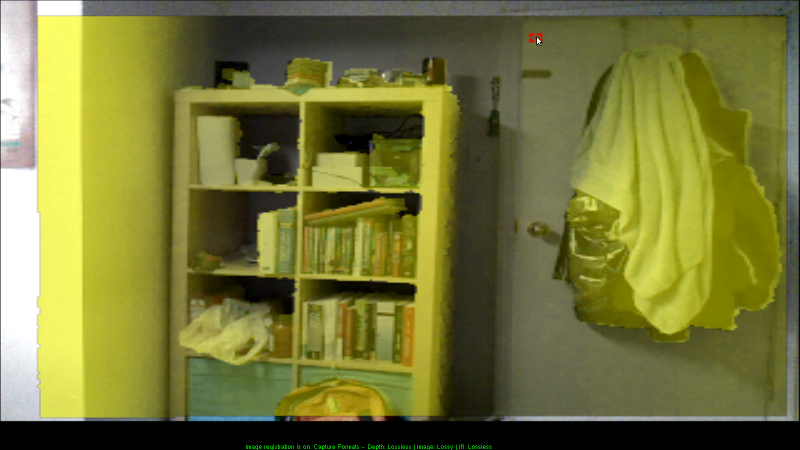
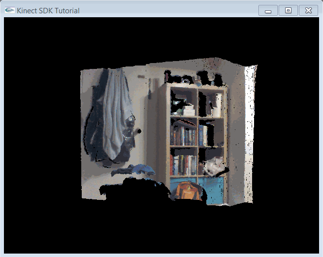

.. _PointCloud:

Kinect 点云
==============

:目标: 学习如何对齐彩色和深度图像，以获得彩色点云。

:源码: `点此查看 <https://github.com/XinArkh/kinect-tutorials-zh/tree/master/src/kinect1/3_PointCloud>`_    :download:`3_PointCloud.zip <../../src/kinect1/3_PointCloud.zip>`

概述
-------

在本章教程中，我们想采取一些新步骤。最有趣的部分就是，我们现在正在处理 3D 数据！但是，创建一个交互式系统的工作量对我们的教程来说有些多了，所以我们只是创建一个简单地旋转点云。本章教程分为三部分：首先，我们简单讨论一下为什么点云可能要比你想像的更难；其次，我们将展示如何使用 Kinect SDK 获取正确的数据；最后，我们将会展示一些可以降低图像展示难度的 OpenGL技巧。

深度和 RGB 坐标系
--------------------

Kinect 坐标系
++++++++++++++++

Kinect 使用以 Kinect 为中心的笛卡尔坐标系统，\ *Y* 轴朝上，\*Z* 轴朝前，\ *X* 轴朝左。

对齐
++++++

最简单的生成点云的方法是直接重叠深度和彩色图像，使深度像素 *(x, y)* 与图像像素 *(x, y)* 一一匹配。然而，这样生成的深度图像质量非常低，对象的边界和颜色无法对齐。这是因为 RGB 相机和深度相机位于 Kinect 上面的不同位置；显然，它们看到的东西并不一致！通常，我们需要对两个相机进行某种对齐操作（正式术语是「注册」， *registration*\ ），来从一个坐标空间映射到另一个坐标空间。幸运的是，微软粑粑已经帮我们做好这件事了，我们唯一需要做的就是调用正确的函数。

**直接重叠 RGB 和深度**

**“注册”后的 RGB 和深度**

要注意，计算机视觉和机器人学方面的研究人员并不喜欢这个内置注册函数的输出质量，所以他们经常用 `OpenCV <http://opencv.org/>`_ 之类的工具手动进行校正。

Kinect 代码
--------------

以下很多代码仅仅是对前面两章教程的综合。

Kinect 初始化
+++++++++++++++++

初始化部分没有新内容。我们需要两个图像流，一个用于深度图像，一个用于彩色图像。

.. code:: cpp

    HANDLE rgbStream;
    HANDLE depthStream;
    INuiSensor* sensor;

    bool initKinect() {
        // Get a working kinect sensor
        int numSensors;
        if (NuiGetSensorCount(&numSensors) < 0 || numSensors < 1) return false;
        if (NuiCreateSensorByIndex(0, &sensor) < 0) return false;

        // Initialize sensor
        sensor->NuiInitialize(NUI_INITIALIZE_FLAG_USES_DEPTH | NUI_INITIALIZE_FLAG_USES_COLOR);

        sensor->NuiImageStreamOpen(
            NUI_IMAGE_TYPE_DEPTH,                     // Depth camera or rgb camera?
            NUI_IMAGE_RESOLUTION_640x480,             // Image resolution
            0,      // Image stream flags, e.g. near mode
            2,      // Number of frames to buffer
            NULL,   // Event handle
            &depthStream);
        sensor->NuiImageStreamOpen(
            NUI_IMAGE_TYPE_COLOR,                     // Depth camera or rgb camera?
            NUI_IMAGE_RESOLUTION_640x480,             // Image resolution
            0,      // Image stream flags, e.g. near mode
            2,      // Number of frames to buffer
            NULL,   // Event handle
            &rgbStream);
        return sensor;
    }

从 Kinect 中获取深度数据
++++++++++++++++++++++++++++++

Kinect SDK 提供了一个函数，告诉你 RGB 图像的哪个像素对应深度图像中的特定点。我们将把这个信息保存在另一个全局数组\ ``depthToRgbMap``\ 中。特别地，我们按照每一个深度像素的顺序，将对应的彩色像素的行和列（即 *x* 和 *y* 坐标）也保存下来。

现在，我们开始处理 3D 数据。我们将深度图像帧想像成空间中的一束点，而不是一个 640*480 的图像。所以在函数\ ``getDepthData()``\ 中，我们将用每个点的坐标（而不是每个像素的深度）来填充我们的缓存区。这意味着对于\ ``float``\ 类型的坐标来说，我们需要填充的缓存区需要达到\ ``width*height*3*sizeof(float)``\ 的大小。

.. code:: cpp

    // Global Variables
    long depthToRgbMap[width*height*2];
    // ...
    void getDepthData(GLubyte* dest) {
    // ...
            const USHORT* curr = (const USHORT*) LockedRect.pBits;
            float* fdest = (float*) dest;
            long* depth2rgb = (long*) depthToRgbMap;
            for (int j = 0; j < height; ++j) {
                for (int i = 0; i < width; ++i) {
                    // Get depth of pixel in millimeters
                    USHORT depth = NuiDepthPixelToDepth(*curr);
                    // Store coordinates of the point corresponding to this pixel
                    Vector4 pos = NuiTransformDepthImageToSkeleton(i,j,*curr);
                    *fdest++ = pos.x/pos.w;
                    *fdest++ = pos.y/pos.w;
                    *fdest++ = pos.z/pos.w;
                    // Store the index into the color array corresponding to this pixel
                    NuiImageGetColorPixelCoordinatesFromDepthPixelAtResolution(
                        NUI_IMAGE_RESOLUTION_640x480, // color frame resolution
                        NUI_IMAGE_RESOLUTION_640x480, // depth frame resolution
                        NULL,                         // pan/zoom of color image (IGNORE THIS)
                        i, j, *curr,                  // Column, row, and depth in depth image
                        depth2rgb, depth2rgb+1        // Output: column and row (x,y) in the color image
                    );
                    depth2rgb += 2;
                    *curr++;
                }
            }
    // ...

这里有很多东西需要解释！

- \ ``Vector4``\ 是微软在齐次坐标系下的的 3D 点类型。如果你的线性代数生疏了，不用担心齐次坐标——只要把它当作一个具有 *x*\ 、\ *y*\ 、\ *z* 坐标的三维点即可。在\ `这个页面 <http://sunshine2k.blogspot.com/2011/12/reason-for-homogeneous-4d-coordinates.html>`_\ 可以找到一个简短的说明。

- \ ``NuiTransformDepthImageToSkeleton()``\ 返回某一特定深度像素的 3D 坐标，坐标系是上面提到的 Kinect 坐标系。这个函数还有一个版本，可以接受一个附加的分辨率参数。

- \ ``NuiImageGetColorPixelCoordinatesFromDepthPixelAtResolution()``\ 接受深度像素（深度图像中的行、列和深度），输出彩色图像中的行和列。\ `API 参考页面 <http://msdn.microsoft.com/en-us/library/jj663857.aspx>`_\ 见此。

.. note::

    **译者注**：同样地，上面的 API 页面已经失效，替代的网页快照\ `见此 <https://web.archive.org/web/20140425111041/http://msdn.microsoft.com/en-us/library/jj663857.aspx>`_\ 。

从 Kinect 中获取彩色数据
+++++++++++++++++++++++++++++

现在，我们考虑的是点而不是矩形网格，我们希望我们的彩色输出与特定的深度点相关联。特殊地，类似于\ ``getDepthData()``\ 函数，我们的\ ``getRgbData()``\ 函数的输入需要一个大小为\ ``width*height*3*sizeof(float)``\ 的缓存区来存储点云中每个点的红、绿、蓝色彩值。

.. code:: cpp

    void getRgbData(GLubyte* dest) {
    // ...
            const BYTE* start = (const BYTE*) LockedRect.pBits;
            float* fdest = (float*) dest;
            long* depth2rgb = (long*) depthToRgbMap;
            for (int j = 0; j < height; ++j) {
                for (int i = 0; i < width; ++i) {
                    // Determine color pixel for depth pixel i,j
                    long x = *depth2rgb++;
                    long y = *depth2rgb++;
                    // If out of bounds, then do not color this pixel
                    if (x < 0 || y < 0 || x > width || y > height) {
                        for (int n = 0; n < 3; ++n) *fdest++ = 0.f;
                    }
                    else {
                        // Determine rgb color for depth pixel (i,j) from color pixel (x,y)
                        const BYTE* color = start + (x+width*y)*4;
                        for (int n = 0; n < 3; ++n) *fdest++ = color[2-n]/255.f;
                    }
                }
            }
    // ...

在最后几行代码中有一些有趣的数学运算，我们来通读一下。首先，彩色图像帧采用 BGRA 格式，每个通道一字节，逐行排列。所以像素 *(x, y)* 的线性指数是\ ``x + width*y``\ 。然后，我们想要的 4 字节块是\ ``start + linearindex*4``\ 。最后，我们想要把按字节取值 (0-255) 的 BGRA 格式转换为按浮点数取值 (0.0-1.0) 的 RGB 格式，所以我们对字节的顺序取反，并除以 255：\ ``color[2-n]/255.f``\ 。

OpenGL 显示
----------------

我们要用数组缓存 (array buffers) 来显示我们的点云。什么是数组缓存？他们允许你通过调用一个函数来替换一系列的\ ``glBegin()``\ 、\ ``glColor()``\ 、\ ``glVertex()``\ 、\ ``glEnd()``\ 调用。另外，数组缓存存储在 GPU 里面，因此显示的时候效率会更高。不过，它们也确实使代码变得更复杂了。想要跳过数组缓存吗？来\ :ref:`这里 <noarraybuffers>`\ 。

要使用数组缓存，我们需要引入 OpenGL 的扩展。为了简化这一过程，我们选择使用 GLEW。

安装 GLEW
++++++++++++

#. 去\ `这个网站 <http://glew.sourceforge.net/>`_\ 下载并解压 GLEW 的二进制文件。
#. 复制解压文件夹中的\ ``include/``\ 和\ ``Lib/``\ 目录，到合适的 Windows SDK 目录中，如：
    - Visual Studio 2010 中：\ ``C:/Program Files/Microsoft SDKs/Windows/v7.0A/Include/``\ 和 \ ``C:/Program Files/Microsoft SDKs/Windows/v7.0A/Lib/``\ 
    - Visual Studio 2012以上：\ ``C:/Program Files/Windows Kits (x86)/8.1/Include/um/``\ 和 \ ``C:/Program Files (x86)/Windows Kits/8.1/Lib/winv6.3/um/``\ 
#. 复制\ ``bin/x64/glew32.dll``\ 到\ ``C:/Windows/System32``\ 、\ ``bin/x86/glew32.dll``\ 到\ ``C:/Windows/SysWOW64``\ 。如果你的系统是 32 位的，只需要把\ ``bin/x86/glew32.dll``\ 复制到\ ``C:/Windows/System32``\ 。

将\ ``glew32.lib``\ 添加至 OpenGL 或 SDL 属性表的\ ``链接器 > 输入 > 附加依赖项``\ 中。

.. note::
    
    \ **译者注**\ ：与\ :ref:`第一章提到的 <install-alternative>`\ 相同，步骤1和2，如果不想污染自己的系统环境，也可以在解压后不去复制这些文件，稍后在 Visual Studio 项目中配置对应地址即可；步骤3，也可以选择与自己系统对应的 .dll 文件，稍后复制到项目的运行目录中。

OpenGL 代码
++++++++++++++

既然是处理 3D 数据，我们还需要注意相机设置。我们使用\ ``gluPerspective()``\ 和\ ``gluLookAt()``\ 函数来为我们解决这个问题。

.. code:: cpp

    // Global variables:
    GLuint vboId; // Vertex buffer ID
    GLuint cboId; // Color buffer ID

        // ...
            // OpenGL setup
            glClearColor(0,0,0,0);
            glClearDepth(1.0f);

            // Set up array buffers
            const int dataSize = width*height * 3 * 4;
            glGenBuffers(1, &vboId);
            glBindBuffer(GL_ARRAY_BUFFER, vboId);
            glBufferData(GL_ARRAY_BUFFER, dataSize, 0, GL_DYNAMIC_DRAW);
            glGenBuffers(1, &cboId);
            glBindBuffer(GL_ARRAY_BUFFER, cboId);
            glBufferData(GL_ARRAY_BUFFER, dataSize, 0, GL_DYNAMIC_DRAW);

            // Camera setup
            glViewport(0, 0, width, height);
            glMatrixMode(GL_PROJECTION);
            glLoadIdentity();
            gluPerspective(45, width /(GLdouble) height, 0.1, 1000);
            glMatrixMode(GL_MODELVIEW);
            glLoadIdentity();
            gluLookAt(0,0,0,0,0,1,0,1,0);

出于显示的目的，我们没有将它写成一个完整的互动界面，只是用一个“旋转”的摄像头，围绕 Kinect 前方 3 米的点旋转。详细信息请参阅代码。

融会贯通
------------

我们写好了\ ``getDepthData()``\ 和\ ``getRgbData()``\ ，但是该怎么用呢？我们所做的就是在 GPU 中分配一些内存，然后用我们的函数去把点云数据复制到那里。

.. code:: cpp

    void getKinectData() {
        const int dataSize = width*height*3*sizeof(float);
        GLubyte* ptr;
        glBindBuffer(GL_ARRAY_BUFFER, vboId);
        ptr = (GLubyte*) glMapBuffer(GL_ARRAY_BUFFER, GL_WRITE_ONLY);
        if (ptr) {
            getDepthData(ptr);
        }
        glUnmapBuffer(GL_ARRAY_BUFFER);

        glBindBuffer(GL_ARRAY_BUFFER, cboId);
        ptr = (GLubyte*) glMapBuffer(GL_ARRAY_BUFFER, GL_WRITE_ONLY);
        if (ptr) {
            getRgbData(ptr);
        }
        glUnmapBuffer(GL_ARRAY_BUFFER);
    }

现在我们想要用\ ``glDrawArrays()``\ 函数来绘制我们的点云。

.. code:: cpp

    void drawKinectData() {
        getKinectData();
        rotateCamera();

        glClear(GL_COLOR_BUFFER_BIT | GL_DEPTH_BUFFER_BIT);
        glEnableClientState(GL_VERTEX_ARRAY);
        glEnableClientState(GL_COLOR_ARRAY);

        glBindBuffer(GL_ARRAY_BUFFER, vboId);
        glVertexPointer(3, GL_FLOAT, 0, NULL);

        glBindBuffer(GL_ARRAY_BUFFER, cboId);
        glColorPointer(3, GL_FLOAT, 0, NULL);

        glPointSize(1.f);
        glDrawArrays(GL_POINTS, 0, width*height);

        glDisableClientState(GL_VERTEX_ARRAY);
        glDisableClientState(GL_COLOR_ARRAY);
    }

.. _noarraybuffers:

注意，我们也可以用下面的代码替换掉所有的数组缓存代码：

.. code:: cpp

    // Global Variables
    float colorarray[width*height*3];
    float vertexarray[width*height*3];
    //...
    void getKinectData() {
        getDepthData((*GLubyte*) vertexarray);
        getRgbData((GLubyte*) colorarray);
    }
    void drawKinectData() {
        getKinectData();
        rotateCamera();
        glBegin(GL_POINTS);
        for (int i = 0; i < width*height; ++i) {
            glColor3f(colorarray[i*3], colorarray[i*3+1], colorarray[i*3+2]);
            glVertex3f(vertexarray[i*3], vertexarray[i*3+1], vertexarray[i*3+2]);
        }
        glEnd();
    }

结束！构建并运行，确保你的 Kinect 已经插入。你应该会看到一个包含 Kinect 所拍摄的旋转的彩色点云的（视频流）窗口。

