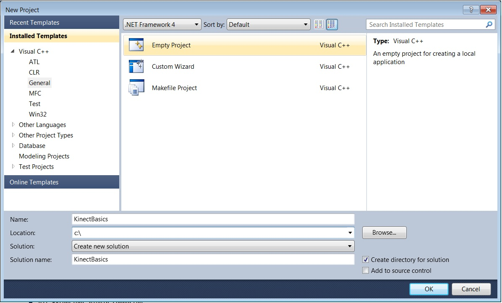
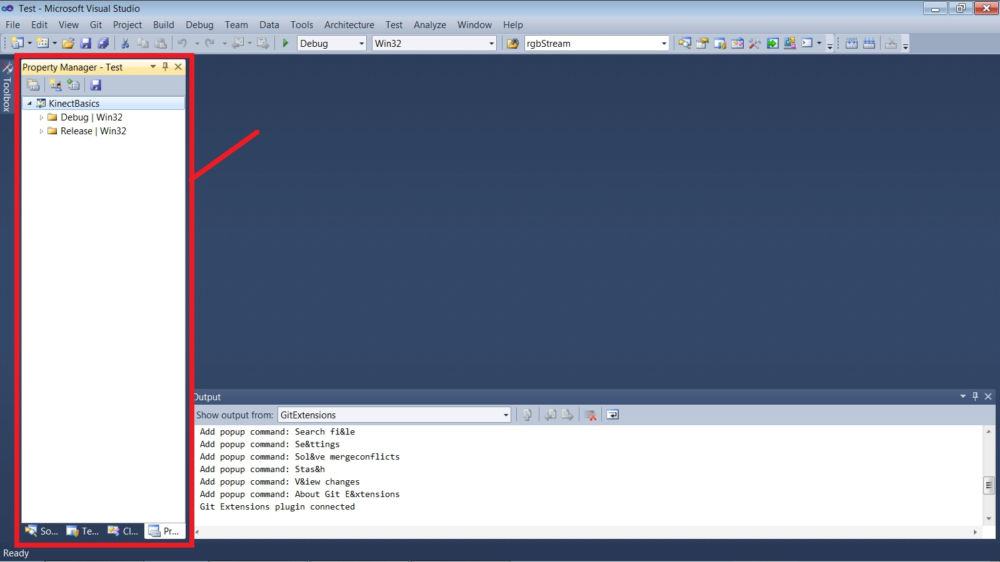
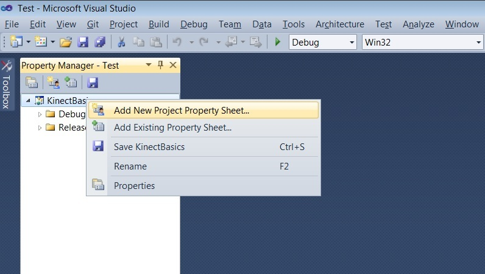
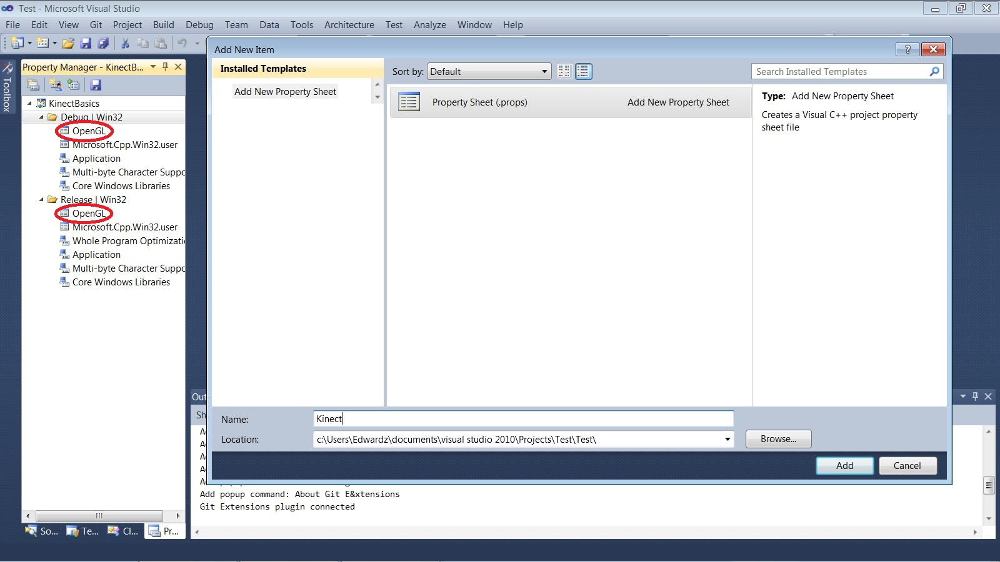
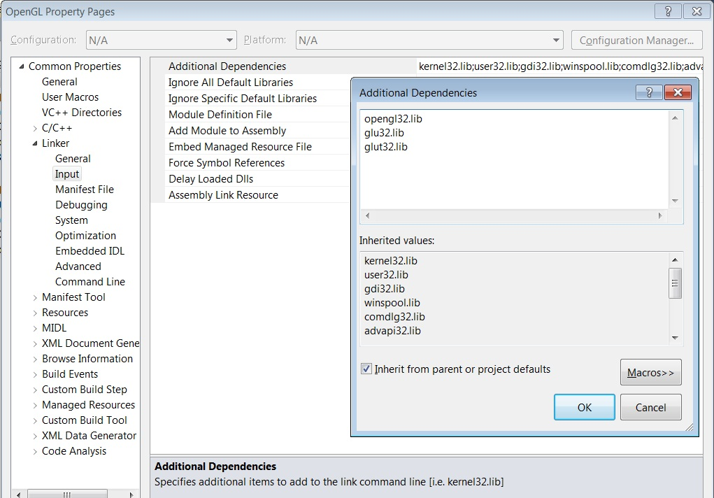

准备工作
============

本系列教程适用于希望使用微软 Kinect SDK 的 C++ 程序员。教程将尽量精简 Windows 代码。我们将使用 OpenGL 提供图形化操作。

:目标: 本章将使用正确的配置初始化一个 Visual Studio 项目。确保你拥有 Kinect 编程所需要的所有组件。

环境需求
-----------

- Windows（这毕竟是Windows SDK嘛~）
- 一台 Kinect（最好是 Kinect for PC）
- Visual Studio（选择一个较新的版本）
- C/C++ 语言编程经验
- 熟悉（或愿意学习）OpenGL

本教程将兼容 GLUT 和 SDL。

.. _glut-installation-2:

安装 GLUT 
-------------

你可以选择使用 GLUT 或 SDL 作为 OpenGL 的接口。在本节中将展示在系统中安装 GLUT 的步骤，你也可以选择跳过本节，在\ :ref:`sdl-installation-2` 一节中查看 SDL 的安装流程。

大多数 windows 系统并不会自带 GLUT。GLUT 是一套在 OpenGL 中用于窗口化和处理事件的代码库，它非常陈旧了，但使用依然很广泛。

#. 去\ `这个网站 <http://www.transmissionzero.co.uk/software/freeglut-devel/>`_\ 下载并解压 MSVC freeglut 的二进制文件。
#. 将刚刚解压的\ ``include/``\ 目录和\ ``lib/``\ 目录中的内容复制到合适的 Windows SDK 目录中，如：
    - Visual Studio 2010 中：\ ``C:/Program Files/Microsoft SDKs/Windows/v7.0A/Include/``\ 和 \ ``C:/Program Files/Microsoft SDKs/Windows/v7.0A/Lib/``\ 
    - Visual Studio 2012以上：\ ``C:/Program Files/Windows Kits (x86)/8.1/Include/um/``\ 和 \ ``C:/Program Files (x86)/Windows Kits/8.1/Lib/winv6.3/um/``\ 
#. 复制\ ``bin/x64/freeglut.dll``\ 到\ ``C:/Windows/System32``\ 、\ ``bin/x86/freeglut.dll``\ 到\ ``C:/Windows/SysWOW64``\ 。如果你的系统是 32 位的，只需要把\ ``bin/x86/freeglut.dll``\ 复制到\ ``C:/Windows/System32``\ 。

.. _install-alternative-2:

.. note::
    
    \ **译者注**\ ：步骤1和2，如果不想污染自己的系统环境，也可以在解压后不去复制这些文件，稍后\ :ref:`在 Visual Studio 项目中配置对应地址 <glut-path-config>`\ 即可；步骤3，也可以选择与自己系统对应的 .dll 文件，稍后复制到项目的运行目录中。

.. _sdl-installation-2:

安装 SDL 
------------

你可以选择使用 GLUT 或 SDL 作为 OpenGL 的接口。在本节中将展示在系统中安装 SDL 的步骤，如果在\ :ref:`上一节 <glut-installation-2>`\ 已选择安装 GLUT，请跳过本节。

去 `SDL 官网 <http://www.libsdl.org/>`_\ 下载下载最新版本的 Visual C++ SDL 开发库。在本教程编写期间 SDL 版本稳定在 `1.2.15 <http://www.libsdl.org/release/SDL-devel-1.2.15-VC.zip>`_ 。

.. note::

    \ **译者注** \：SDL 开发库对应官网中的 **Development Libraries**\ ，不是 **Runtime Binaries**\ 。

将下载到的压缩文件解压至一个合适的位置（如：\ ``C:\``\ ）。

人生苦短，做完下面两件事，会让我们的生活会更加惬意：

#. \ **复制**\ ``SDL.dll``\ **到我们的系统目录中。**\ 打开\ ``C:\SDL-1.2.15\lib\x64``\ （32 位系统下为\ ``/x86``\ ），复制\ ``SDL.dll``\ 。如果你的系统是 64 位的，就将其粘贴到\ ``C:\Windows\SysWOW64``\ 中；否则，就将它粘贴到\ ``C:\Windows\System32``\ 。
#. \ **将 SDL 文件夹添加为一项环境变量。**\ 打开系统的环境变量，新建一个变量，其中变量名为\ ``SDL_DIR``\ 、变量值为 SDL 文件夹所在地址，如：\ ``C:\SDL-1.2.15``\ 。

.. note::

    \ **译者注** \：同样，.dll 文件也可以不必复制到系统目录，只需稍后复制到项目的运行目录中。

新建 Kinect 项目
--------------------

打开 Visual Studio，并新建一个 C++ 空项目。

为了配置构建规则（即 includes 和 libs），我们需要使用\ **属性管理器**\ 。将不同组件的配置保存在不同的配置文件中，可以方便之后重复使用。

属性管理器可以在\ **视图**\ 菜单中打开。

为了模块化配置，我们创建一个属性表用于 OpenGL 信息，另一个用于 Kinect SDK 信息。在属性管理器中，右键项目名称，选择\ **添加新项目属性表**\ ，命名为 **OpenGL**\ ；再新建一个属性表，命名为 **KinectSDK**\ 。你将会在 “Debug” 和 “Release” 目录下看到以它们命名的新属性表。属性表是包含构建配置数据的、后缀为 .props 的文件。

首先配置Kinect 属性。**右键 Kinect 属性表，点击“属性”。**

- **在**\ ``C/C++ > 常规 > 附加包含目录``\ **中，添加**\ ``$(KINECTSDK20_DIR)/inc``\ **。**
- **在**\ ``链接器 > 常规 > 附加库目录``\ **中，添加**\ ``$(KINECTSDK20_DIR)/lib/amd64``\ **（32 位系统下为**\ ``/x86``\ **）。**
- **在**\ ``链接器 > 输入 > 附加依赖项``\ **中，添加**\ ``kinect20.lib``\ **。**

注意，要添加 include 和 library 目录，你可以直接在对应输入框中键入，也可以单击下拉框，选择\ **<编辑>**\ ，然后在弹出的对话框中输入位置。这种方法可以在管理多个目录的时候轻松一些，并且让你浏览目录更加清晰准确（如果不使用\ ``KINECTSDK20_DIR``\ 这样的环境变量）。

.. note::

    \ **译者注** \：包含文件和库文件也可以直接添加在属性表的\ ``VC++目录 > 包含目录``\ 和\ ``VC++目录 > 库目录``\ 中。

.. note::

    \ **译者注** \：注意检查 Kinect SDK 的包含文件和库文件目录是否正确，最好在文件夹中打开确认一下。

接下来，配置 OpenGL 属性表。

GLUT 方式
+++++++++++

如果在前面选择了 GLUT 作为 OpenGL 的接口，需要依据本节步骤配置 OpenGL 属性表。

**右键 OpenGL 属性表，点击“属性”，在**\ ``链接器 > 输入 > 附加依赖项``\ **中，添加以下内容：**

::

    opengl32.lib
    glu32.lib
    freeglut.lib

.. _glut-path-config:

.. note::

    \ **译者注** \：如果在\ :ref:`安装 GLUT <glut-installation>` 时没有将对应包含文件和库文件复制到系统目录下，还需要将它们的地址添加到该属性表对应的包含目录和库目录中。

SDL 方式
+++++++++++

如果在前面选择了 SDL 作为 OpenGL 的接口，需要依据本节步骤配置 OpenGL 属性表。

**右键 OpenGL 属性表，点击“属性”。**

- **在**\ ``C/C++ > 常规 > 附加包含目录``\ **中，添加**\ ``$(SDL_DIR)\include``\ **。**
- **在**\ ``链接器 > 常规 > 附加库目录``\ **中，添加**\ ``$(SDL_DIR)\lib\x64``\ **（32 位系统下为**\ ``/x86``\ **）。**
- **在**\ ``链接器 > 输入 > 附加依赖项``\ **中，添加以下内容：**

::

    opengl32.lib
    glu32.lib
    SDL.lib
    SDLmain.lib

.. image:: ../images/0/0_3_2.jpg

至此，我们的项目就准备好了。