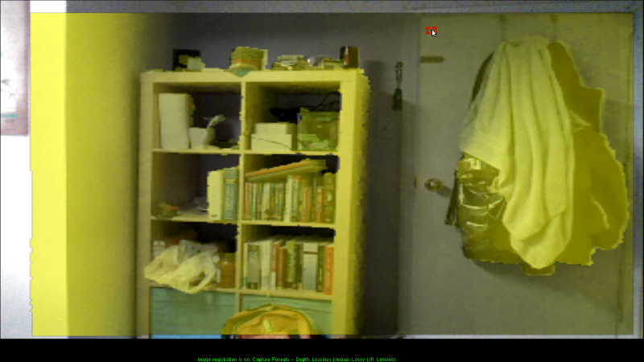
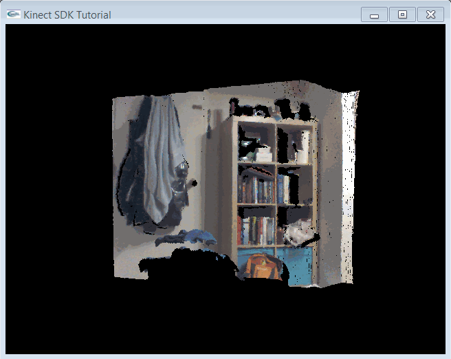

.. _PointCloud-2:

Kinect 点云
==============

:目标: 学习如何对齐彩色和深度图像，以获得彩色点云。

:源码: `点此查看 <https://github.com/XinArkh/kinect-tutorials-zh/tree/master/src/kinect2/3_PointCloud>`_    :download:`3_PointCloud.zip <../../src/kinect2/3_PointCloud.zip>`

概述
-------

在本章教程中，我们想采取一些新步骤。最有趣的部分就是，我们现在正在处理 3D 数据！但是，创建一个交互式系统的工作量对我们的教程来说有些多了，所以我们只是创建一个简单地旋转点云。本章教程分为三部分：首先，我们简单讨论一下为什么点云可能要比你想像的更难；其次，我们将展示如何使用 Kinect SDK 获取正确的数据；最后，我们将会展示一些可以降低图像展示难度的 OpenGL技巧。

深度和 RGB 坐标系
--------------------

Kinect 坐标系
++++++++++++++++

Kinect 使用以 Kinect 的红外传感器为中心的笛卡尔坐标系统，\ *Y* 轴朝上，\*Z* 轴朝前，\ *X* 轴朝左。坐标系中单位长度为 1 米。

对齐
++++++

最简单的生成点云的方法是直接重叠深度和彩色图像，使深度像素 *(x, y)* 与图像像素 *(x, y)* 一一匹配。然而，这样生成的深度图像质量非常低，对象的边界和颜色无法对齐。这是因为 RGB 相机和深度相机位于 Kinect 上面的不同位置；显然，它们看到的东西并不一致！通常，我们需要对两个相机进行某种对齐操作（正式术语是「注册」， *registration*\ ），这样我们就可以知道哪个彩色像素是与哪个深度像素相对应了。幸运的是，微软粑粑已经帮我们做好这件事了，我们唯一需要做的就是调用正确的函数。

**直接重叠 RGB 和深度**

.. image:: ../images/3/3_1.png

**“注册”后的 RGB 和深度**

要注意，计算机视觉和机器人学方面的研究人员并不喜欢这个内置注册函数的输出质量，所以他们经常用 `OpenCV <http://opencv.org/>`_ 之类的工具手动进行校正。

Kinect 代码
--------------

我们需要处理两个新问题，相应地也有两个新的接口：

- 在此之前，我们每次只需要处理一个数据流。然而，现在我们要同时使用彩色和深度数据（可能还有其他类型的数据，比如红外或身体跟踪数据），我们希望确保正在处理的数据是同步的。否则，彩色图像和深度数据将会对应不起来！为了解决这个问题，我们使用\ ``MultiSourceFrameReader``\ ，它可以提供多个同步的数据帧输入源。
- 为了处理上面提到的不同坐标系统，SDK 提供了一个可以完成所有转换工作的对象：\ ``ICoordinateMapper``\ 。

Kinect 初始化
+++++++++++++++++

.. code:: cpp

    IKinectSensor* sensor;             // Kinect sensor
    IMultiSourceFrameReader* reader;   // Kinect data source
    ICoordinateMapper* mapper;         // Converts between depth, color, and 3d coordinates

    bool initKinect() {
        if (FAILED(GetDefaultKinectSensor(&sensor))) {
            return false;
        }
        if (sensor) {
            sensor->get_CoordinateMapper(&mapper);

            sensor->Open();
            sensor->OpenMultiSourceFrameReader(
                FrameSourceTypes::FrameSourceTypes_Depth | FrameSourceTypes::FrameSourceTypes_Color,
                &reader);
            return reader;
        } else {
            return false;
        }
    }

我们通过指定在帧中需要哪些数据来打开\ ``MultiSourceFrameReader()``\ 。我们还可以请求红外数据、身体跟踪数据和音频数据。我们不需要从帧读取器中单独处理帧输入源。

我们还在这里初始化了\ ``ICoordinateMapper``\ 。

从 MultiSourceFrame 中获取深度数据
++++++++++++++++++++++++++++++++++++++

无论是深度数据还是颜色数据，我们都可以从\ ``MultiSourceFrame``\ 中得到熟悉的\ ``IDepthFrame``\ 和\ ``IColorFrame``\ 。下面是深度数据对应的代码:

.. code:: cpp

    void getKinectData() {
        IMultiSourceFrame* frame = NULL;
        reader->AcquireLatestFrame(&frame);
        // ...
        getDepthData(frame, dest);
        // ...
        getColorData(frame, dest;
    }

    void getDepthData(IMultiSourceFrame* frame, GLubyte* dest) {
        IDepthFrame* depthframe;
        IDepthFrameReference* frameref = NULL;
        frame->get_DepthFrameReference(&frameref);
        frameref->AcquireFrame(&depthframe);
        if (frameref) frameref->Release();
        if (!depthframe) return;

        // Process depth frame data...

        if (depthframe) depthframe->Release();
    }

这段代码基本与彩色数据部分相同，只要用 "color" 替换所有出现的 "depth"。

使用坐标系映射接口
+++++++++++++++++++++

我们在这个程序中处理了三个不同的坐标空间：

- 点云坐标所在的 3D (XYZ) 空间，用于显示。
- 1920*1080 彩色图像中，像素坐标的二维（列、行）空间。
- 512*424 深度图像中，像素坐标的二维（列、行）空间。

我们将为深度图像中的每个像素显示一个 3D 点。每个点都有对应的 RGB 颜色和 XYZ 坐标。因此，我们将使用\ ``CoordinateMapper``\ 获取深度像素坐标与三维点坐标之间的查找表映射，以及深度像素坐标与彩色图像中相应像素之间的另一个映射。

.. code:: cpp

    // Global Variables
    /*
     For reference:
     struct ColorSpacePoint { float X, Y; };
     struct CameraSpacePoint { float X, Y, Z; };
    */
    ColorSpacePoint depth2rgb[width*height];     // Maps depth pixels to rgb pixels
    CameraSpacePoint depth2xyz[width*height];    // Maps depth pixels to 3d coordinates

    // ...

    void getDepthData(IMultiSourceFrame* frame, GLubyte* dest) {
        IDepthFrame* depthframe;
        // Populate depthframe from MultiSourceFrame...

        // Get data from frame
        unsigned int sz;
        unsigned short* buf;
        depthframe->AccessUnderlyingBuffer(&sz, &buf);

        mapper->MapDepthFrameToCameraSpace(
                width*height, buf,        // Depth frame data and size of depth frame
                width*height, depth2xyz); // Output CameraSpacePoint array and size
        mapper->MapDepthFrameToColorSpace(
                width*height, buf,        // Depth frame data and size of depth frame
                width*height, depth2rgb); // Output ColorSpacePoint array and size
    }

为了得到这些映射，我们调用适当的\ ``ICoordinateMapper``\ 函数。你可以在\ `ICoordinateMapper文档 <https://msdn.microsoft.com/en-us/library/windowspreview.kinect.coordinatemapper.aspx>`_\ 中找到其他可能的映射。请注意，大多数映射函数都需要深度帧作为输入数组（即使是名称中没有以 "DepthFrame" 开头的映射函数）。

从 Kinect 中获取深度数据
+++++++++++++++++++++++++++++

现在我们处理 3D 数据。我们想把深度图像帧想像成空间中的一束点，而不是一个 512*424 的图像。因此在我们的\ ``getDepthData()``\ 函数中，我们将用每个点的坐标（而不是每个像素的深度）填充我们的缓冲区。这意味着对于\ ``float``\ 类型的坐标来说，我们需要填充的缓存区需要达到\ ``width*height*3*sizeof(float)``\ 的大小。

这里，我们只使用\ ``CoordinateMapper``\ 的\ ``depth2xyz``\ 映射。

.. code:: cpp

    void getDepthData(IMultiSourceFrame* frame, GLubyte* dest) {
    // Populate depth2xyz map...
        float* fdest = (float*)dest;
        for (int i = 0; i < width*height i++) {
            *fdest++ = depth2xyz[i].X;
            *fdest++ = depth2xyz[i].Y;
            *fdest++ = depth2xyz[i].Z;
        }
    /* We use the fdest pointer for conciseness. Equivalently, we could use
        for (int i = 0; i < width*height; i++) {
            fdest[3*i+0] = depth2xyz[i].X;
            fdest[3*i+1] = depth2xyz[i].Y;
            fdest[3*i+2] = depth2xyz[i].Z;
        }
    */
    }

从 Kinect 中获取彩色数据
+++++++++++++++++++++++++++++

现在，我们考虑的是点而不是矩形网格，我们希望我们的彩色输出与特定的深度点相关联。特殊地，类似于\ ``getDepthData()``\ 函数，我们的\ ``getRgbData()``\ 函数的输入需要一个大小为\ ``width*height*3*sizeof(float)``\ 的缓存区来存储点云中每个点的红、绿、蓝色彩值。

.. code:: cpp

    void getRgbData(IMultiSourceFrame* frame, GLubyte* dest) {
        IColorFrame* colorframe;

        // Populate colorframe...

        colorframe->CopyConvertedFrameDataToArray(colorwidth*colorheight*4, rgbimage, ColorImageFormat_Rgba);

        // Write color array for vertices
        float* fdest = (float*)dest;
        for (int i = 0; i < width*height; i++) {
            ColorSpacePoint p = depth2rgb[i];
            // Check if color pixel coordinates are in bounds
            if (p.X < 0 || p.Y < 0 || p.X > colorwidth || p.Y > colorheight) {
                *fdest++ = 0;
                *fdest++ = 0;
                *fdest++ = 0;
            }
            else {
                int idx = (int)p.X + colorwidth*(int)p.Y;
                *fdest++ = rgbimage[4*idx + 0]/255.;
                *fdest++ = rgbimage[4*idx + 1]/255.;
                *fdest++ = rgbimage[4*idx + 2]/255.;
            }
            // Don't copy alpha channel
        }
        /* We use fdest pointer for conciseness; Equivalently, we could use

        for (int i = 0; i < width*height; i++) {
            fdest[3*i+0] = ...
            fdest[3*i+1] = ...
            fdest[3*i+2] = ...
        }
         */
     }

在这个块中，我们遍历深度图像的像素，使用从\ ``CoordinateMapper``\ 获取的\ ``depth2xyz``\ 映射查找彩色图像中的对应坐标。我们检查每个深度像素是否确实映射到了 RGB 图像中的某个像素上面，如果没有，那么我们就手动给这个点分配为黑色。

在最后几行代码中有一些有趣的数学运算，我们来通读一下。首先，彩色图像帧采用 BGRA 格式，每个通道一字节，逐行排列。所以像素 *(x, y)* 的线性指数是\ ``x + width*y``\ 。\ *X*\ 和\ *Y*\ 可以是浮点数，所以在使用它们作为数组索引之前，我们先将它们向下取整为\ ``int``\ 类型。然后，我们想要的 4 字节块位于\ ``linearindex*4``\ 。最后，我们想要把按字节取值 (0-255) 的 BGRA 格式转换为按浮点数取值 (0.0-1.0) 的 RGB 格式，所以我们取前三个通道，并除以 255：\ ``rgbimage[4*linearindex + channel]/255.f``\ 。

OpenGL 显示
----------------

我们要用数组缓存 (array buffers) 来显示我们的点云。什么是数组缓存？他们允许你通过调用一个函数来替换一系列的\ ``glBegin()``\ 、\ ``glColor()``\ 、\ ``glVertex()``\ 、\ ``glEnd()``\ 调用。另外，数组缓存存储在 GPU 里面，因此显示的时候效率会更高。不过，它们也确实使代码变得更复杂了。想要跳过数组缓存吗？来\ :ref:`这里 <noarraybuffers-2>`\ 。

要使用数组缓存，我们需要引入 OpenGL 的扩展。为了简化这一过程，我们选择使用 GLEW。

安装 GLEW
++++++++++++

#. 去\ `这个网站 <http://glew.sourceforge.net/>`_\ 下载并解压 GLEW 的二进制文件。
#. 复制解压文件夹中的\ ``include/``\ 和\ ``Lib/``\ 目录，到合适的 Windows SDK 目录中，如：
    - Visual Studio 2010 中：\ ``C:/Program Files/Microsoft SDKs/Windows/v7.0A/Include/``\ 和 \ ``C:/Program Files/Microsoft SDKs/Windows/v7.0A/Lib/``\ 
    - Visual Studio 2012以上：\ ``C:/Program Files/Windows Kits (x86)/8.1/Include/um/``\ 和 \ ``C:/Program Files (x86)/Windows Kits/8.1/Lib/winv6.3/um/``\ 
#. 复制\ ``bin/x64/glew32.dll``\ 到\ ``C:/Windows/System32``\ 、\ ``bin/x86/glew32.dll``\ 到\ ``C:/Windows/SysWOW64``\ 。如果你的系统是 32 位的，只需要把\ ``bin/x86/glew32.dll``\ 复制到\ ``C:/Windows/System32``\ 。

将\ ``glew32.lib``\ 添加至 OpenGL 或 SDL 属性表的\ ``链接器 > 输入 > 附加依赖项``\ 中。

.. note::
    
    \ **译者注**\ ：与\ :ref:`第一章提到的 <install-alternative-2>`\ 相同，步骤1和2，如果不想污染自己的系统环境，也可以在解压后不去复制这些文件，稍后在 Visual Studio 项目中配置对应地址即可；步骤3，也可以选择与自己系统对应的 .dll 文件，稍后复制到项目的运行目录中。

OpenGL 代码
++++++++++++++

既然是处理 3D 数据，我们还需要注意相机设置。我们使用\ ``gluPerspective()``\ 和\ ``gluLookAt()``\ 函数来为我们解决这个问题。

.. code:: cpp

    // Global variables:
    GLuint vboId; // Vertex buffer ID
    GLuint cboId; // Color buffer ID

        // ...
            // OpenGL setup
            glClearColor(0,0,0,0);
            glClearDepth(1.0f);

            // Set up array buffers
            const int dataSize = width*height * 3 * 4;
            glGenBuffers(1, &vboId);
            glBindBuffer(GL_ARRAY_BUFFER, vboId);
            glBufferData(GL_ARRAY_BUFFER, dataSize, 0, GL_DYNAMIC_DRAW);
            glGenBuffers(1, &cboId);
            glBindBuffer(GL_ARRAY_BUFFER, cboId);
            glBufferData(GL_ARRAY_BUFFER, dataSize, 0, GL_DYNAMIC_DRAW);

            // Camera setup
            glViewport(0, 0, width, height);
            glMatrixMode(GL_PROJECTION);
            glLoadIdentity();
            gluPerspective(45, width /(GLdouble) height, 0.1, 1000);
            glMatrixMode(GL_MODELVIEW);
            glLoadIdentity();
            gluLookAt(0,0,0,0,0,1,0,1,0);

出于显示的目的，我们没有将它写成一个完整的互动界面，只是用一个“旋转”的摄像头，围绕 Kinect 前方 3 米的点旋转。详细信息请参阅代码。

融会贯通
------------

我们写好了\ ``getDepthData()``\ 和\ ``getRgbData()``\ ，但是该怎么用呢？我们希望将适当的数据从\ ``MultiSourceFrame``\ 中复制到 GPU 上。

.. code:: cpp

    void getKinectData() {
        IMultiSourceFrame* frame = NULL;
        if (SUCCEEDED(reader->AcquireLatestFrame(&frame))) {
            GLubyte* ptr;
            glBindBuffer(GL_ARRAY_BUFFER, vboId);
            ptr = (GLubyte*)glMapBuffer(GL_ARRAY_BUFFER, GL_WRITE_ONLY);
            if (ptr) {
                getDepthData(frame, ptr);
            }
            glUnmapBuffer(GL_ARRAY_BUFFER);
            glBindBuffer(GL_ARRAY_BUFFER, cboId);
            ptr = (GLubyte*)glMapBuffer(GL_ARRAY_BUFFER, GL_WRITE_ONLY);
            if (ptr) {
                getRgbData(frame, ptr);
            }
            glUnmapBuffer(GL_ARRAY_BUFFER);
        }
        if (frame) frame->Release();
    }

现在我们想要用\ ``glDrawArrays()``\ 函数来绘制我们的点云。

.. code:: cpp

    void drawKinectData() {
        getKinectData();
        rotateCamera();

        glClear(GL_COLOR_BUFFER_BIT | GL_DEPTH_BUFFER_BIT);
        glEnableClientState(GL_VERTEX_ARRAY);
        glEnableClientState(GL_COLOR_ARRAY);

        glBindBuffer(GL_ARRAY_BUFFER, vboId);
        glVertexPointer(3, GL_FLOAT, 0, NULL);

        glBindBuffer(GL_ARRAY_BUFFER, cboId);
        glColorPointer(3, GL_FLOAT, 0, NULL);

        glPointSize(1.f);
        glDrawArrays(GL_POINTS, 0, width*height);

        glDisableClientState(GL_VERTEX_ARRAY);
        glDisableClientState(GL_COLOR_ARRAY);
    }

.. _noarraybuffers-2:

注意，我们也可以用下面的代码替换掉所有的数组缓存代码：

.. code:: cpp

    // Global Variables
    float colorarray[width*height*3];
    float vertexarray[width*height*3];
    //...
    void getKinectData() {
        getDepthData((*GLubyte*) vertexarray);
        getRgbData((GLubyte*) colorarray);
    }
    void drawKinectData() {
        getKinectData();
        rotateCamera();
        glBegin(GL_POINTS);
        for (int i = 0; i < width*height; ++i) {
            glColor3f(colorarray[i*3], colorarray[i*3+1], colorarray[i*3+2]);
            glVertex3f(vertexarray[i*3], vertexarray[i*3+1], vertexarray[i*3+2]);
        }
        glEnd();
    }

结束！构建并运行，确保你的 Kinect 已经插入。你应该会看到一个包含 Kinect 所拍摄的旋转的彩色点云的（视频流）窗口。

